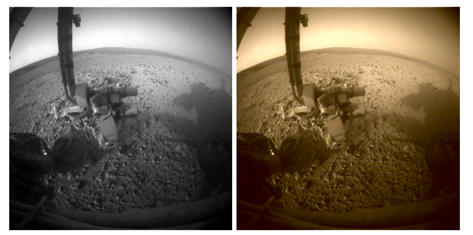

# Opportunity-Rover-Colourised

## Blogpost
Read the full write-up for this project at [cutwell.github.io](https://cutwell.github.io/opportunity-rover-colourised/)

## Reproduction
This project made use of the now shutdown FloydHub platform, but other cloud-based platforms should perform just as well (or on a local machine, although 32GB+ of memory is required).

### Dataset collection and filtering
Collect image data from NASA API:
> Due to rate limiting, this step may take several hours/days, requiring manual adjustment of the script for collecting new ranges of data. Read the script comments first.

```python3 data/curiosity/getCuriosity.py```

```python3 data/opportunity/getOpportunity.py```

Curiosity dataset has numerous imperfect images (too blurry, small image, corrupt, etc.), so we must filter these:

```python3 data/curiosity/filterSet.py```

Images in both datasets are too massive, so are split into 256 64*64 squares per image, so the network can train and colourise images by segments:

```python3 data/curiosity/sliceColor.py```

```python3 data/opportunity/sliceGreyscale.py```

### Floydhub commands
Generate the fresh model:

```floyd run "python3 new.py" --data zachary946/datasets/opportunity-model-save-fix/1:data --gpu```

Train the model:

```floyd run "python3 train.py" --data zachary946/datasets/curiosity-rover-dataset/1:curiosity --data zachary946/projects/opportunity-rover-colourised/JOB:model --gpu --tensorboard```

Running the model on unseen data:

```floyd run "python3 colourise.py" --data zachary946/datasets/opportunity-rover-dataset/1:opportunity --data zachary946/projects/opportunity-rover-colourised/JOB:model --gpu```

Stitching model output into full images:
```floyd run "python3 stitchOutput.py" --data zachary946/projects/opportunity-rover-colourised/JOB:data --gpu```

Stitching model output into .mov:

```floyd run "python3 makeVideo.py" --data zachary946/projects/opportunity-rover-colourised/JOB:data```

## Thanks
This project makes use and is inspired by two separate projects - [Colouring Grayscale Images](https://github.com/emilwallner/Coloring-greyscale-images/blob/master/floydhub/Beta-version/beta_version.ipynb) by [Emilwallner](https://github.com/emilwallner/) and [Opportunity's Journey](https://github.com/thatguywiththatname/Opportunitys-Journey) by [Psidex](https://github.com/Psidex/) - both of which you should take time to explore.
